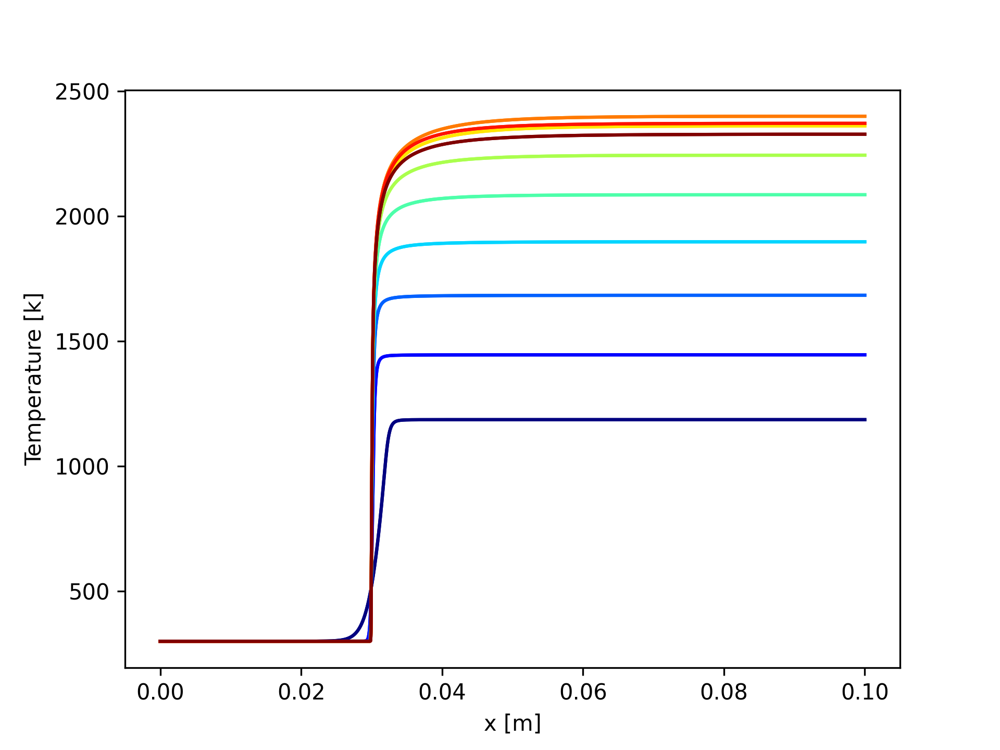
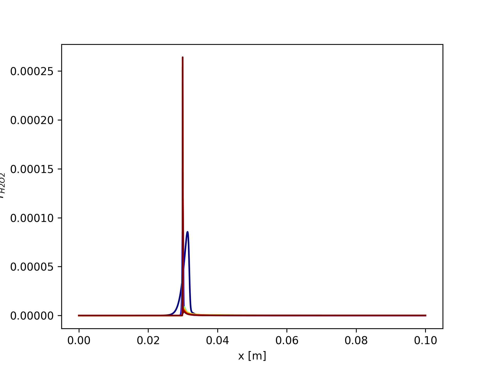

# Simple Flame 

A brief description of your project goes here.

## Table of Contents

- [Installation](#installation)
- [Usage](#usage)

## Installation

We recommend installing a unique python environment using `python3.11` as that is the latest python version that supports cantera. To create a unique environmnet:

```terminal
mkdir ~/python_environments/
cd ~/python_environments/
python3.11 -m venv flame
source ~/python_environments/flame/bin/activate
```

you can add to you bashrc/zshrc file
```
alias flame="source ~/python_environments/flame/bin/activate"
```

which will allow you to access the source from command line

```terminal
flame
```

Once you have your unique python environment, you can install the requirements via

```bash
python3 -m pip install cantera numpy matplotlib 
```

## Usage

Two scripts are provided, the first is `simple_1d.py` which can be run as

```terminal
python3 simple_1d.py
```

This will automatically generate 10 solutions in a data folder. The lower indices refer to a fuel lean flame (phi<1), the higher indices refer to a fuel rich flame (phi>1). You can change the 
number of solution by updated `n_data_sets`. And you can change the lower and upper bound of phi by changing `np.linspace(0.3,1.3,n_data_sets)`

Running `post_data.py` will post process the flame data and generate graphs of the species specific flame data and temperature. In these solutions pressure is constant. I did not add a velocity post processor, but that data is stored.

To run the post processor us the command
```terminal
python3 post_data.py
```
and you should get 10 images to start, one for Temperature for all phi, and one for each species. Examples below




